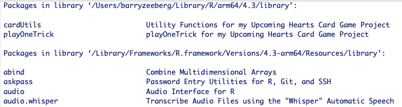

<b style='mso-bidi-font-weight:
normal'><o:p>&nbsp;</o:p></b>

<b style='mso-bidi-font-weight:
normal'><o:p>&nbsp;</o:p></b>

<b style='mso-bidi-font-weight:
normal'>Barry
Zeeberg<o:p></o:p></b>

<b style='mso-bidi-font-weight:
normal'>barryz2013@gmail.com<o:p></o:p></b>
 

<o:p>&nbsp;</o:p>

**MOTIVATION**

I recently submitted a package *NoviceDeveloperResources*. As described there, the several commands in the sequence to take package folders containing your raw R program file to a functional package attached to your search path are not too tedious to execute once or twice. But if you are developing a set of inter-related packages, and you need to fine tune them, the process can become quite repetitive, confusing, and tedious. To facilitate this, within the *NoviceDeveloperResources* package I have provided the function

**x<-checkBuildInstallSourcePackage(dir,packs,packCheck,autoLibrary)**

The parameter *packs* is a list of the names of packages to be processed.

If you are running *checkBuildInstallSourcePackage()* because you modified a certain package, then packs should include the name of that package as well as any other packages which *import()* that package. Otherwise those other packages may remain linked to the obsoleted version of that package. Furthermore, the names of these packages in the input list packs must be in the correct order so that the upper level packages *import()* the new version of the leaf node packages, rather than simply once again *import()* the obsolete version. This could be figured out manually, but the process is tedious and error-prone.

**ADDITIONAL INTEGRATED FUNCTIONS**

The current CRAN package *NoviceDeveloperResources2* contains an integrated program **sortedInputForCheckBuildInstallSourcePackageDriver()** to invoke *checkBuildInstallSourcePackage()* with the package names in the correct order within *packs*. This driver is the single master function to run in order to invoke all of the other functions in the packages *NoviceDeveloperResources* and *NoviceDeveloperResources2*.

I will use a rather complicated set of recently-posted packages to illustrate the examples.

The hierarchy of imported packages is shown in Figure 1.

Figure 1. The hierarchy of imported packages.

There are 2 main functions in this package:

**sortedInputForCheckBuildInstallSourcePackage()** computes a list of packages in the correct order (Figure 2) to input to *checkBuildInstallSourcePackage()*. Note that in the input to *bottomUpRecursiveDriver()*, *iterationDriver* was designated as the only package that contained a modification. As shown in Figure 1, this package is imported by packages *playOneTrick* and *playWholeHandDriverPassParams*, so the order of the 3 packages to *checkBuildInstallSourcePackage()* must be in the order given in the bottom line in Figure 2.

Figure 2. Snippet of the output while running the example for **sortedInputForCheckBuildInstallSourcePackage()**. *packs* had been set to c("playOneTrick","iterationDriver","playWholeHandDriverPassParams").

**sortedInputForCheckBuildInstallSourcePackageDriver()** is a driver to invoke the sequence of functions to retrieve the correctly ordered list of packages (as sketched in Figure 2) and to submit this list (contained in the parameter *s*) to *checkBuildInstallSourcePackage()*.

**HOW TO IMPLEMENT GLOBAL VARIABLES ACROSS MULTIPLE PACKAGES**

I include this section because I experienced a great deal of unnecessary difficulty figuring out how to implement global variables across multiple files. It was next to impossible for me to find a statement that I could understand, and equally impossible to find snippets of a specific working example. To make life easier for the novice developer, I will now provide both of these.

There are three considerations:

**1. How to include a global variable in a function within packages (P2, P3, . . .), if that variable is defined or assigned a value in a different package P1**

Assume that P1 is imported by P2, P3, . . . . Then the first line (outside of any function definitions) in all packages will be

**globalVariables(c("global1","global2", . . .))**

where global1 *etc.* are the names of the global variables, and each such name is enclosed in quotation marks. The global variables can be simple scalars, or vectors, matrices, *etc.*. This is explained in language for the more advanced user in [https://rdrr.io/r/utils/globalVariables.html.](https://rdrr.io/r/utils/globalVariables.html)

Here is a real-world example:
The package *cardUtils* plays the role of P1

{width=100%}
Figure 3. The *globalVariables()* line as the first line in cardUtils.R, outside of any function definitions.

The package *editDriver* plays the role of P2. Notice that the list of variables is a subset of that for *cardUtils*, including only those that are actually used in *editDriver*.

{width=100%}
Figure 4. The *globalVariables()* line as the first line in editDriver.R, outside of any function definitions.

**2. How to assign/change the value of a global variable**

There appear to be 2 ways to assign/change the value of a global variable. One way is to use the symbol *<<-*, and the other way is to use the *assign()* function. After much research, I have found that you should **NEVER** use *<<-*, especially in a package that you intend to submit to CRAN. The documentation for *assign()* can be found by typing *help(assign)* in the R Console. 

Here is a real-world example:

{width=100%}

Figure 5. Example of *assign()* within a function call in the cardUtils package.

Executing *globalDefs()* will result in *e.g.* epsilon.fp showing up as a global variable in the output of the *ls()* command in the R Console.

{width=100%}

Figure 6. Global variables in the output of the *ls()* command in the R Console.

**3. If you have a global variable that is *e.g.* a vector, how to assign/change the value of a component of that vector**

Say that you have a global variable g that is a vector like g[1:5]. Through trial and error, I have found that the way to change the value of *e.g.* g[3] is to copy the entire vector to a local vector l, then change the value within the local vector l, and *assign()* the local vector l to the global vector g.

Here is a real-world example:

{width=80%}

Figure 7. Example of using a local copy of a global matrix to change a single value within the global matrix (see lines 987 through 989).

**MISCELLANEOUS THINGS THAT ARE HARD TO FIGURE OUT **

**1. How to generate and retrieve data for use in examples**

When you are writing an example for a function in a package, it may sometimes be quite tedious to generate the various data and data structures that are needed. However, these items are generated naturally during a run of the program. We can capture these items as they are generated, and (literally) *save()* them for future retrieval.

The first step is to create a subdirectory named *data* within the main package directory.

Next, scan through the code to find the locations where a desired data item is generated. Insert a line of code that makes a copy of this item, naming the copy  as *x_[actual name of the item]*. The x will remind you that this is an example item, and it will prevent any possible confusion with the actual item.

Next, issue a *save()* command specifying the path name, as shown in the real-life scenario, in which the first line is a real line of code, and the next 2 lines are inserted to show how to save the data item. After the items are saved in the data directory, comment out the 2 extra lines. It is best to leave them there, in case, at a later time, you need to review (or possibly re-do) what you had done.

**gtab<-gtable::gtable_add_grob(gtab,scatter,scatterPlotRow,1,name="scatter") 
x_gtab2<-gtab 
save(x_gtab2,file=sprintf("%s/%s/%s",getwd(),"data","x_gtab2.RData"))**  

There is one final step, namely you need to add a documentation file, for each .RData file, to the *man* subdirectory. For the example given here, the name of this file will be *x_gtab2.Rd*:

  
**2. How to access data in a subdirectory of another package**

Say you are writing an example for a function in package A, and the example needs to use data that is in a subdirectory of package B. You can use the *system.file()* command.

Here is a real-life scenario in which I am preparing an example for a function in package A and package B is *cardUtils*

**actualFile<-system.file("extdata/tcpflow.dir/tcpflow.subd/processed.subdir/Actual/Hand7.txt",package="cardUtils") 
actual<-as.matrix(read.table(actualFile))[1:52,1:4] 
lead(actual=actual,leader=2)**  

**3. How to run a non-R program script from R code in a package**

Say you have an *awk* script in a .awk file that is invoked by an R function in a package. You will need to specify the absolute path name for the .awk file. Fortunately this can be done dynamically using the *getSysLib()* function.

Here is a real-world example. In this case, the .awk file is located in the *inst* subdirectory of the *retrieve* package. But in the specification within the library directory the *inst* is not included in the path name.

Note also that the *awk* script is invoked by the *system()* command

**syst=sprintf("gawk -f %s/retrieve/handsWithoutBots.awk %s",getSysLib(),f) 
good<-system(syst,intern=TRUE)**

 

**4. How to invoke *library()* from R code in a package**

You are not allowed to issue a *library()* command from within a function in a CRAN package. The purpose of this restriction is to avoid inadvertently changing the search path without the user's knowledge.

There are 2 options for working around this restriction:

Less convenient option is to generate a character string as the return value of the function, that can be printed using "echo" and then the user explicitly copy and paste to load or update the packages. This can be preceded by a detach() command to make sure that the library() command results in the search path containing the latest version of the package.

**returnStr<-sprintf("%s\\ndetach(\\"package:%s\\")",returnStr,pack) 
returnStr<-sprintf("%s\\nlibrary(%s)",returnStr,pack) 
return(returnStr)**

A more convenient option is to pass a Boolean parameter *autoLibrary* (whose default value is FALSE) to the function, so that the user must explicitly set it to TRUE and thus knowingly implement the library() command using the *eval(parse())* mechanism. This can be preceded by a detach() command to make sure that the library() command results in the search path containing the latest version of the package. This automates the process, and the user no longer needs to copy and paste.

**if(autoLibrary) { 
eval(parse(text = sprintf("detach(\\"package:%s\\")",pack))) 
eval(parse(text = sprintf("library(%s)",pack))) 
}**
  

**5. How to maintain consistency in library accesses**

This is a more or less hidden feature that gave me a lot of trouble until I understood how it works. I hope I can save you some of that trouble.

Here is an abbreviated version of the type of output you might see when you issue the **library()** command from the R Console, (Figure. 8). This shows 2 libraries, the user library and the system library.

I initially did not understand that there are these 2 separate libraries, and this ignorance led to a lot of frustration. For instance, if you edit the R source code within your package, and then re-install it, the package version with the updated source code will end up in one of the two libraries. If you do not explicitly specify which library, you are at the mercy of a default mechanism that is happening in a hidden manner. Likewise, when you load the package into your search path, you are again at the mercy of a default mechanism that is happening in a hidden manner. The net result is that you may end up using the older version of the package.

Now I avoid those problems by consistently using only the system library. That is, I save updates only to the system library, and I access only the system library. Here are the technical details showing how to accomplish these goals within my own R code.

**NoviceDeveloperResources::getSysLib()** will return the full path name of the system library.

In the NoviceDeveloperResources package, installation into the correct library is performed by
**install.packages(b,repos=NULL,type='source',lib=lib,verbose=TRUE),type="message")**
where lib is specified as the system library.

Loading is carried out *via* a line of code in NoviceDeveloperResources::zload()
**eval(parse(text = sprintf("library(%s,lib.loc='%s', verbose=TRUE)",pack,lib.loc)))**
where lib.loc is specified as the system library.

Within RStudio, under "Build > Configure Build Tools..." type in to the install package options space: 
"-l " followed by the full path name of the system library  as shown in Figure 9.

  

**GRAPHICAL DISPLAY OF INTER-RELATIONSHIP OF PACKAGES AND PROGRAMS **

My package *foodwebWrapper* (available in CRAN) provides a graphical representation that might help to keep track of the complex relationships that occur in a project that is split across multiple packages. Please see the *foodwebWrapper* package documentation and vignettes for full details.

Figure 10 shows the depiction of the callers and callees for a complex project that includes 10 inter-related packages. Each **row** represents a caller, and each **column** represents a callee. The names of the callers are given along the left side of the figure, and the names of the callees are given along the top of the figure.

{width=300%}

Figure 10. Depiction of foodwebWrapper analysis for the set of 10 CRAN packages that comprise my hearts card game project.
